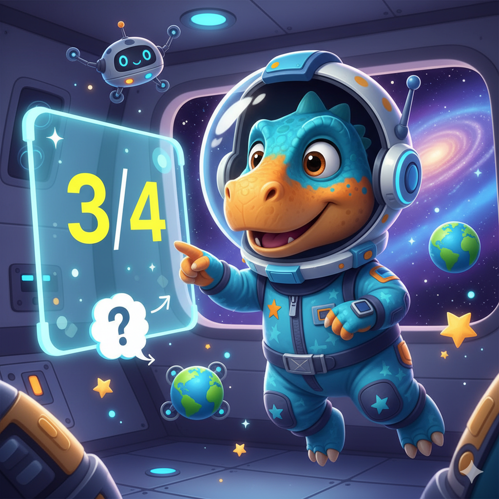

# Trabajo Final: IA Gamificada para Niños con TDAH: Aprender Jugando con Prompt Engineering

## Resumen

Se propone el diseño de un sistema de generación de contenido educativo gamificado mediante prompt engineering, orientado a niños de entre 8 y 12 años con Trastorno por Déficit de Atención e Hiperactividad (TDAH).
El objetivo es transformar lecciones escolares en experiencias interactivas, con misiones, preguntas de opción múltiple y retroalimentación positiva. Se implementan prompts adaptados para la API de Gemini, garantizando la posibilidad de producir salidas estructuradas en JSON, lo que facilita el desarrollo de aplicaciones interactivas. Asimismo, se incluyen ejemplos de prompts para generar imágenes educativas que complementen las historias.

## Índice

1. Introducción
2. Objetivos
3. Metodología
4. Herramientas y Tecnologías
5. Viabilidad
6. Implementación
    1. Requerimientos
    2. Código
        1. Carga de la API KEY
        2. Información sobre los prompts
        3. Código Texto-Texto
        4. Aclaración importante
        5. Código Texto-Imagen
7. Resultados
8. Conclusiones

## 1. Introducción

El Trastorno por Déficit de Atención e Hiperactividad (TDAH) afecta la forma en que muchos niños aprenden y procesan la información. En particular, entre los 8 y 12 años, la concentración sostenida y la memorización de conceptos abstractos resultan muy difíciles.
En contextos educativos tradicionales, los niños con TDAH suelen perder la motivación rápidamente, lo que deriva en frustración, bajo rendimiento y una percepción negativa del estudio. Es un problema relevante porque impacta no solo en lo académico, sino también en la autoestima y en la integración social de los niños.

## 2. Objetivos

-   Diseñar prompts capaces de transformar contenido educativo en narrativas gamificadas.
-   Incorporar preguntas de opción múltiple con retroalimentación positiva inmediata.
-   Definir un formato estructurado de salida (JSON) para facilitar la integración con aplicaciones.

## 3. Metodología

1. **Diseño de prompts:**
    - Texto → Texto: generar historias interactivas, preguntas y feedback en JSON.
    - Texto → Imagen: generar personajes, escenarios y recompensas visuales.
2. **Pruebas de salida:** validar que los modelos devuelvan JSON válido y narrativas adaptadas a la edad objetivo.
3. **Iteración y ajuste:** modificar los prompts para mejorar la calidad de la narrativa y la claridad de las preguntas.

## 4. Herramientas y Tecnologías

-   Python como lenguaje de implementación.
-   Google Gemini API para generación de texto y, opcionalmente, imágenes.
-   Gestión de variables de entorno con .env para proteger la API Key.
-   Bibliotecas: google-genai, dotenv.

## 5. Viabilidad:

-   Técnica:
    -   Totalmente viable, tanto Gemini como chatGPT pueden realizar una respuesta en formato json, solo requiere un mínimo de procesamiento de texto previo ya que lo devuelve dentro de un formato markdown.
-   Económicamente:
    -   La generación de imágenes es más costosa, pero se puede realizar una demostración técnica utilizando generadores gratuitos como leonardo.ai o Gemini en su versión web.

## 6. Implementación

### Requerimientos

Para poder ejecutarlo debe obtener una free api key de Gemini y crear un .env en la carpeta raíz con el siguiente código

`API_KEY="Tu api key"`

Antes de correrlo debe ejecutar el siguiente comando en la carpeta raíz

`pip install -r "requirements.txt"`

### Código

El código se encuentra en TP-Final-IA_GeneracionDePrompts.ipynb

### Ejecución del prompt con las palabras claves a ingresar

Se diseñaron prompts parametrizados que aceptan variables, para poder cambiar el tema de la asignatura, la ambientación de la misión, la edad del niño y el tono de respuesta de la IA.

También se pide que responda en formato json para facilitar la creación de un software de preguntas y respuestas interactivas.

El prompt de las imágenes también fue parametrizado para que se pueda cambiar el personaje, el estilo de la imagen, la edad del niño al cual está dirigido y la pregunta que se desea ilustrar para contextualizar la misma.

### _Prompt para obtener preguntas estilo múltiple Choice:_

Convierte esta lección sobre {tema} en una misión interactiva estilo {ambientacion}.
La historia debe estar dirigida a un niño de {edad} años con TDAH.
Incluye preguntas de opción múltiple, respuestas con feedback positivo, y un tono {tono}.

Devuelve la respuesta en JSON válido con el siguiente formato:

```json
{{
  "historia": "texto breve con la narrativa gamificada",
  "preguntas": [
    {{
      "pregunta": "string",
      "opciones": ["string", "string", "string"],
      "respuesta_correcta": "string",
      "feedback": {{
        "correcto": "string",
        "incorrecto": "string"
      }}
    }}
  ]
}}
```

### _Prompt para generar imágenes:_

Genera una imagen de un personaje caricaturesco de {personaje}, en estilo {estilo},
colorido y amigable, pensado para un niño de {edad} años.
El personaje debe estar contextualizado en base al siguiente ambiente: "{ambientacion}" y a la siguiente pregunta educativa:
'{pregunta}'. No agregues texto a la imagen

Por ejemplo:

Genera una imagen de un personaje caricaturesco de dinosaurio, en estilo cartoon,  colorido y amigable, pensado para un niño de 9 años.  El personaje debe estar contextualizado en base al siguiente ambiente: "Exploradores espaciales" y a la siguiente pregunta educativa:  '¡Excelente inicio, cadete! Para empezar nuestra misión, necesitamos entender la anatomía de una fracción. Si tienes la fracción 3/4, ¿qué representa el número '3'?'. No agregues texto a la imagen

Imagen de demostración utilizando Gemini desde el navegador web:



## 7. Resultados

En las pruebas realizadas con la API de Gemini se obtuvieron los siguientes hallazgos:

#### Texto → Texto:

-   El modelo respondió con narrativas breves y preguntas de opción múltiple.

-   El formato JSON pudo obtenerse de manera válida, aunque fue necesario limpiar código en formato markdown para convertirlo en un json.

-   El feedback positivo generado por el modelo fue consistente y adecuado para el rango etario definido (8–12 años).

#### Texto → Imagen:

-   Se lograron personajes visualmente atractivos, con estilo caricaturesco y amigable.

-   El principal problema fue la inclusión de texto dentro de las imágenes: los resultados presentaron errores ortográficos y de legibilidad, lo que limita su uso directo en contextos educativos. Teniendo esto en cuenta se optó por pedirle a la IA que no genere texto en las imágenes.

## 8. Conclusiones

-   Viabilidad confirmada: los prompts diseñados son capaces de convertir contenidos educativos en narrativas gamificadas con formato estructurado, lo cual facilita su integración en software educativo.

-   Enfoque pedagógico: el uso de misiones cortas, feedback inmediato y tono motivador resulta especialmente adecuado para niños con TDAH.

Siguientes pasos:

-   Ampliar el set de prompts para diferentes materias y estilos narrativos.

-   Implementar un prototipo de interfaz que consuma el JSON.
